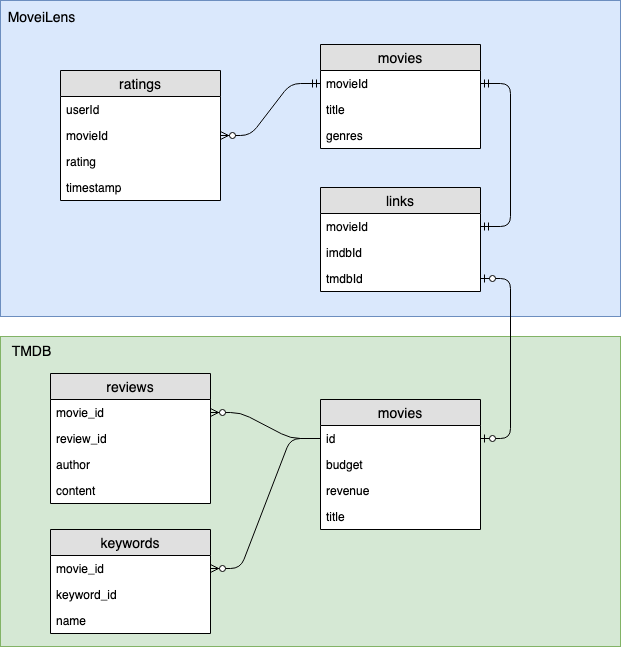
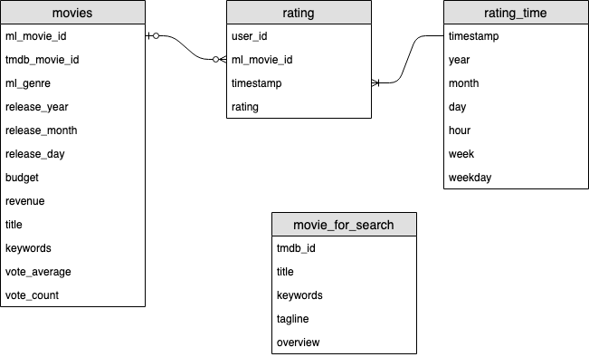

## Purpose of the project

In this project, I will provide an data model where users can analyze movie review data.
We can access several open movie data across the world [^tmdb][^imdb][^movielens].
While these data can be used for research of recommendation or text analysis, each dataset have own advantage and disadvantage.
For example Movie Lens is a famous dataset which contains many anonymized user ratings about movies. But the dataset have little data about movie's features such as actors or revenue.
TMDB is another movie dataset which contains details of movie data. Since movie lens's dataset provide `link.csv` which contains references to other public dataset such as TMDB or IMDB, we can combin these dataset into the single data model which enhances the analysis process. So in this project I will make a pipe line which combines different movie dataset to a single data model.

In this project, I think of two usecases for this data model. One is a creating recommendation model. This is a main purpose of Movie Lens dataset. Another usecase is a search index. Fulltext search is ubiquitous

## Steps of the project

This project contains the following steps:

1. Collect TMDB data through the TMBD API
2. Upload collected data to S3
3. Upload MovieLens dataset to S3
4. Combine MovieLens and TMDB dataset using Apache Spark
5. Save processed data to S3

### 1. Collect TMDB data through the TMBD API

Movie data in the TMDB is provided through the API.
Since the API returns a single movie data from a request.
I should collect movie data using successive api calls.

We can get latest movie list from `http://files.tmdb.org/p/exports/` endpoint[^tmdbex]. Since the TMDB have over the 480K movie data and API call is limited 40 request per 10 second, it takes 1.5 days ($1.5 \approx 480K/(24*3600*4)$) to obtain all movie data. The returned data stored temporarily local database.

### 2. Upload collected data to S3

The collect TMDB data are uploaded to the S3 storage. I upload the data periodically for each 10K items.

### 3. Upload MovieLens dataset to S3

I use "MovieLens Latest Datasets" which contains _27,000,000 ratings and 1,100,000 tag applications applied to 58,000 movies by 280,000 users. Includes tag genome data with 14 million relevance scores across 1,100 tags. Last updated 9/2018._ [^movielens].

The data is provided as a zip file including some csv files.
We can download the file, unzip and upload the resulted csv file to the S3.

### 4. Combine MovieLens and TMDB dataset using Apache Spark

In order to parse TMDB's json data, I use apache spark [^spark]. I create spark environment in EMR service in the AWS[^emr].

### 5. Save processed data to S3

Processed data are saved in Parquet format in S3[^parquet].

## Reference

[^tmdb]: https://www.themoviedb.org
[^imdb]: https://www.imdb.com
[^movielens]: https://grouplens.org/datasets/movielens/
[^tmbdex]: https://developers.themoviedb.org/3/getting-started/daily-file-exports
[^spark]: https://spark.apache.org
[^emr]: https://docs.aws.amazon.com/ja_jp/emr/latest/ManagementGuide/emr-overview.html
[^parquet]: https://parquet.apache.org

## Scenarios

### "the data was increased by 100x"

Now, each of the MovieLens dataset is provided as a single file, but they can be
split multiple files and can be uploaded to S3. The S3 is capable for very large data with low cost. In this project, the raw data files are easily loaded by using spark's `read.csv(path/*)`. In the spark, the dataset are processed in the multiple partitions. We can scale up the aws EC2 instance or scale out by increasing partition number of spark process.

### "the pipelines would be run on a daily basis by 7 am every day."

Although the MovieLens dataset does not update frequently, TMDB's dataset is constantly updated.
In order to collect the whole TMDB's movie data, it takes 1.5 days. But once we got the data, TMDB provide `/movie/changes` API which returns a list of movie ids that have changed in past 24 hours.
The list looks have $\sim 2k$ items. When we request movie data 3 items per second, we can collect the changed movie list in 2 hours.
In this pipe line, the changed movie list will be uploaded S3 as a update file. And before the etl process, this update file will be merged with the current raw dataset. So we can complete the pipe line in daily bases.

### "The database needed to be accessed by 100+ people."

The resulted data are stored in S3 of AWS. The datamodel is made for data analysis which is read intensive usecase. S3 is capable for 5,500 requests per second[^s3spec].
In this pipeline, I use AWS EMR with Jupyterhub as a Spark environment. The Jupyterhub serves jupyter notebook for multiple users. With this configuration, I think the data model can be available for 100+ people.

[^s3spec]: https://docs.aws.amazon.com/AmazonS3/latest/dev/optimizing-performance.html
[^jupyhub]: https://jupyterhub.readthedocs.io/en/stable/

## Data quality check

- Check that the same movie are appropriately combined

MovieLens data movie and TMDB movie have same movie title

- Check all data not empty

Check the resulted data have non zero data.

### TMDB API

In order to get TMDB data, you should create get API key.

## Data schema

## About Dataset

As source of data, I use the following dataset.

- MovieLens
- The Movie DataBase

### MovieLens

In addition to ratings, MovieLens provide some dataset.
Here, I use the following data.

- movies.csv
- links.csv
- ratings.csv

### The Movie Database (TMDB)

The Movie Database provide many movie features through their API such as review of users. By using the `append_to_response` url parameter, we can get related information in a single movie detail request.
I collect the following information from the API.

- movies
- keywords
- reviews

## ER Diagram

This is a ER diagram of raw dataset and result data.
In TMDB, the data is provided by json format with many fields.
The diagram depicts only a few items for simplicity.

### Input data

### Output data

